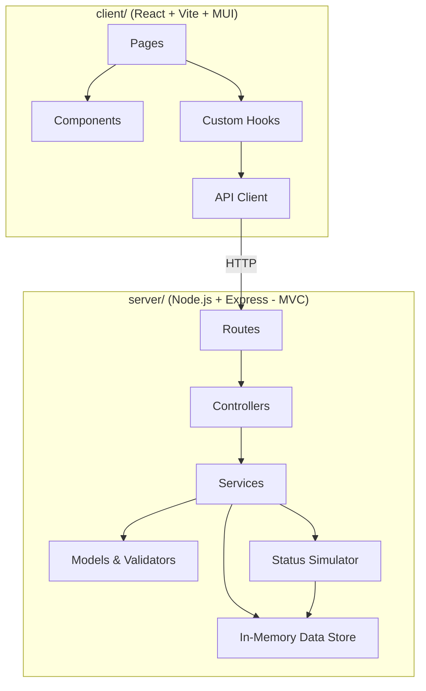
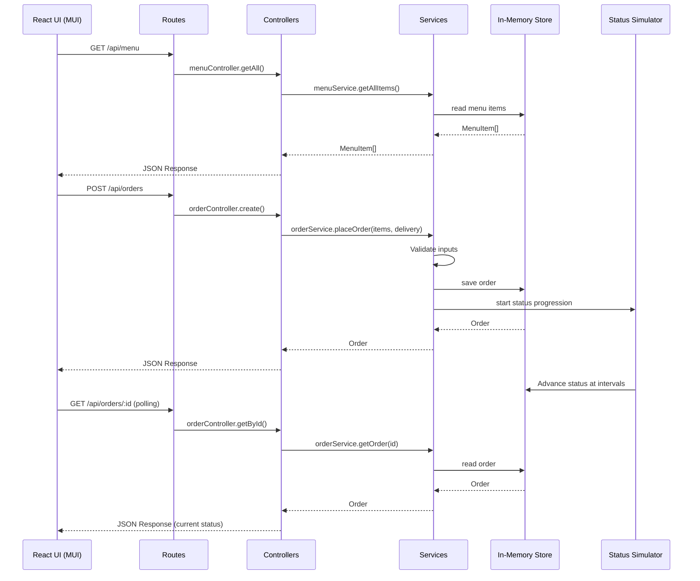

# Design Document: Order Management

## Overview

The Order Management feature is a full-stack food delivery application. The frontend is a React + Vite app using Material UI (MUI), located in the `client/` folder. The backend is a Node.js + Express REST API located in the `server/` folder, following an MVC-like architecture with routes, controllers, services, and models. Data is stored in-memory. A status simulator on the backend automatically advances order status to simulate real-time delivery tracking.

## Architecture



### Folder Structure

```
client/
  src/
    components/       # Reusable UI components
    pages/            # Page-level components
    hooks/            # Custom React hooks
    api/              # API client functions
    theme/            # MUI theme configuration
    App.tsx
    main.tsx
server/
  src/
    routes/           # Express route definitions
    controllers/      # Request/response handling
    services/         # Business logic
    models/           # Data models, types, validators
    data/             # In-memory data store & seed data
    simulator/        # Order status simulator
    app.ts            # Express app setup
    index.ts          # Server entry point
```

### Request Flow



## Components and Interfaces

### Server Models

#### MenuItem
```typescript
interface MenuItem {
  id: string;
  name: string;
  description: string;
  price: number;       // positive number, in dollars
  imageUrl: string;
}
```

#### DeliveryDetails
```typescript
interface DeliveryDetails {
  name: string;        // non-empty
  address: string;     // non-empty
  phone: string;       // matches /^\+?[\d\s\-()]{7,15}$/
}
```

#### OrderStatus and Order
```typescript
type OrderStatus = "Order Received" | "Preparing" | "Out for Delivery" | "Delivered";

const STATUS_SEQUENCE: OrderStatus[] = [
  "Order Received", "Preparing", "Out for Delivery", "Delivered"
];

interface OrderItem {
  menuItemId: string;
  name: string;
  price: number;
  quantity: number;
}

interface Order {
  id: string;
  items: OrderItem[];
  deliveryDetails: DeliveryDetails;
  totalPrice: number;
  status: OrderStatus;
  createdAt: string;   // ISO 8601
}
```

#### Validators
```typescript
function validateDeliveryDetails(details: DeliveryDetails): ValidationResult;
function validateOrderItems(items: OrderItem[]): ValidationResult;

interface ValidationResult {
  valid: boolean;
  errors: string[];
}
```

### Server Services

#### menuService
```typescript
function getAllItems(): MenuItem[];
function getItemById(id: string): MenuItem | undefined;
```

#### orderService
```typescript
function placeOrder(items: { menuItemId: string; quantity: number }[], delivery: DeliveryDetails): Order;
function getOrder(id: string): Order | undefined;
function getAllOrders(): Order[];
function updateOrderStatus(id: string, status: OrderStatus): Order;
```

#### statusSimulator
```typescript
function startSimulation(orderId: string, intervalMs?: number): void;
function stopSimulation(orderId: string): void;
```
Advances order status through STATUS_SEQUENCE at configurable intervals (default: 10s per stage). Stops at "Delivered".

### Server Controllers

#### menuController
```typescript
function getAll(req: Request, res: Response): void;
// Delegates to menuService.getAllItems(), returns JSON array
```

#### orderController
```typescript
function create(req: Request, res: Response): void;
// Validates request body, delegates to orderService.placeOrder(), returns 201 with Order
// Returns 400 with error details on validation failure

function getAll(req: Request, res: Response): void;
// Delegates to orderService.getAllOrders(), returns JSON array

function getById(req: Request, res: Response): void;
// Delegates to orderService.getOrder(id), returns Order or 404

function updateStatus(req: Request, res: Response): void;
// Validates status transition, delegates to orderService.updateOrderStatus(), returns Order or 400
```

### Server Routes

| Method | Path              | Controller Method            | Description                  |
|--------|-------------------|------------------------------|------------------------------|
| GET    | /api/menu         | menuController.getAll        | Get all menu items           |
| POST   | /api/orders       | orderController.create       | Place a new order            |
| GET    | /api/orders       | orderController.getAll       | Get all orders               |
| GET    | /api/orders/:id   | orderController.getById      | Get order by ID              |
| PATCH  | /api/orders/:id   | orderController.updateStatus | Update order status          |

### Request/Response Shapes

```typescript
// POST /api/orders request body
interface PlaceOrderRequest {
  items: { menuItemId: string; quantity: number }[];
  delivery: { name: string; address: string; phone: string };
}

// Error response
interface ErrorResponse {
  error: string;
  details?: string[];
}
```

### Client Components (MUI-based)

#### Pages
- **MenuPage**: Full-width grid of food item cards with "Add to Cart" buttons. Uses MUI `Grid`, `Card`, `CardMedia`, `CardContent`, `CardActions`. Includes a floating cart badge in the AppBar.
- **CartPage**: List of cart items with quantity stepper controls (+/-), line totals, and a prominent "Proceed to Checkout" button. Uses MUI `List`, `ListItem`, `IconButton`, `Typography`, `Divider`.
- **CheckoutPage**: Clean form for delivery details with inline validation. Uses MUI `TextField`, `Button`, `Alert`. Shows order summary sidebar.
- **OrderStatusPage**: Order details with a visual stepper showing status progression. Uses MUI `Stepper`, `Step`, `StepLabel`, `Card`, `Chip`. Polls for updates.
- **OrdersPage**: List of all placed orders with status chips. Uses MUI `Table` or `List` with clickable rows.

#### Reusable Components
- **NavBar**: Top navigation with app title, cart badge icon, and navigation links. Uses MUI `AppBar`, `Toolbar`, `Badge`, `IconButton`.
- **MenuItemCard**: Card displaying food item image, name, description, price, and add-to-cart button.
- **CartItemRow**: Row with item name, price, quantity controls (MUI `ButtonGroup`), line total, and remove button.
- **OrderStatusStepper**: Visual stepper component showing order progress through the four stages.
- **EmptyState**: Friendly empty state with illustration/icon and message. Used for empty cart, empty menu, no orders.

#### Theme
- Custom MUI theme with warm, appetizing color palette (e.g., orange/amber primary, dark text)
- Responsive design with MUI breakpoints
- Consistent spacing and typography using MUI's theme system

#### React Hooks
- **useMenu()**: Fetches menu items from `GET /api/menu`
- **useCart()**: Manages cart state with `useReducer` (add, remove, update quantity, clear, compute total)
- **useOrders()**: Fetches all orders, places orders via `POST /api/orders`
- **useOrderStatus(orderId)**: Polls `GET /api/orders/:id` at intervals for status updates

#### Cart State (Frontend)
```typescript
interface CartItem {
  menuItem: MenuItem;
  quantity: number;
}

type CartAction =
  | { type: "ADD_ITEM"; menuItem: MenuItem }
  | { type: "UPDATE_QUANTITY"; menuItemId: string; quantity: number }
  | { type: "REMOVE_ITEM"; menuItemId: string }
  | { type: "CLEAR" };

function cartReducer(state: CartItem[], action: CartAction): CartItem[];
```

## Data Models

### Seed Menu Data
```typescript
const SEED_MENU: MenuItem[] = [
  { id: "1", name: "Margherita Pizza", description: "Classic tomato and mozzarella on a crispy crust", price: 12.99, imageUrl: "/images/pizza.jpg" },
  { id: "2", name: "Classic Cheeseburger", description: "Juicy beef patty with melted cheddar", price: 9.99, imageUrl: "/images/burger.jpg" },
  { id: "3", name: "Caesar Salad", description: "Crisp romaine with parmesan and Caesar dressing", price: 8.49, imageUrl: "/images/salad.jpg" },
  { id: "4", name: "Spicy Chicken Wings", description: "Crispy wings tossed in hot sauce", price: 10.99, imageUrl: "/images/wings.jpg" },
  { id: "5", name: "Pasta Carbonara", description: "Creamy pasta with crispy bacon and parmesan", price: 13.49, imageUrl: "/images/pasta.jpg" },
  { id: "6", name: "Veggie Wrap", description: "Fresh vegetables in a whole wheat tortilla", price: 7.99, imageUrl: "/images/wrap.jpg" },
];
```

### In-Memory Store
```typescript
// Simple module-level state
let menuItems: MenuItem[] = [...SEED_MENU];
let orders: Map<string, Order> = new Map();
```

## Correctness Properties

*A property is a characteristic or behavior that should hold true across all valid executions of a system — essentially, a formal statement about what the system should do. Properties serve as the bridge between human-readable specifications and machine-verifiable correctness guarantees.*

### Property 1: Cart add item behavior

*For any* cart and any MenuItem, adding the item to the cart should result in: if the item was not already in the cart, a new line item with quantity 1 is created; if the item was already in the cart, the existing line item's quantity is incremented by 1. All other line items remain unchanged.

**Validates: Requirements 2.1, 2.2**

### Property 2: Cart update quantity

*For any* cart containing a line item and any positive integer quantity, updating that line item's quantity should set it to exactly the specified value, leaving all other line items unchanged.

**Validates: Requirements 2.3**

### Property 3: Cart remove on zero quantity

*For any* cart containing a line item, setting that line item's quantity to zero should remove it from the cart. The resulting cart should contain one fewer item, and all other line items remain unchanged.

**Validates: Requirements 2.4**

### Property 4: Cart total computation

*For any* cart with any number of line items (each with a positive price and positive integer quantity), the computed total should equal the sum of (price × quantity) for each line item, rounded to two decimal places.

**Validates: Requirements 2.5**

### Property 5: Order placement produces valid order

*For any* valid DeliveryDetails and any non-empty list of order items with valid quantities, placing an order should produce an Order with status "Order Received", a non-empty ID, the correct items, the correct delivery details, a total matching the computed cart total, and a valid ISO 8601 timestamp.

**Validates: Requirements 3.1, 3.5**

### Property 6: Delivery details validation

*For any* DeliveryDetails object, validation should pass if and only if the name is a non-empty string, the address is a non-empty string, and the phone matches the pattern `/^\+?[\d\s\-()]{7,15}$/`. For any invalid DeliveryDetails, the validation result should list exactly the fields that are invalid.

**Validates: Requirements 3.2, 3.4, 6.1, 6.2**

### Property 7: Order persistence round-trip

*For any* successfully placed order, retrieving that order by its ID should return an order with equivalent items, delivery details, total price, status, and timestamp.

**Validates: Requirements 3.5, 4.1, 5.2**

### Property 8: Cart cleared after order placement

*For any* non-empty cart, after successfully placing an order, the cart should be empty (contain zero line items).

**Validates: Requirements 3.6**

### Property 9: Order status sequence invariant

*For any* Order, the status must only advance forward through the sequence ["Order Received", "Preparing", "Out for Delivery", "Delivered"]. The index of the new status in the sequence must always be greater than the index of the current status.

**Validates: Requirements 4.3**

### Property 10: Invalid quantity rejection

*For any* order placement request containing a line item with a quantity that is zero, negative, or non-integer, the validation should reject the request with an appropriate error.

**Validates: Requirements 6.3**

### Property 11: Order serialization round-trip

*For any* valid Order entity, serializing it to JSON and then deserializing the JSON back should produce an Order entity equivalent to the original.

**Validates: Requirements 8.3**

### Property 12: All orders retrievable

*For any* set of successfully placed orders, requesting all orders should return a list containing every placed order. The length of the returned list should equal the number of orders placed.

**Validates: Requirements 5.1**

## Error Handling

### Backend Error Responses

| Error Scenario | HTTP Status | Response |
|---|---|---|
| Empty cart on order placement | 400 | `{ error: "Cart is empty" }` |
| Missing required delivery fields | 400 | `{ error: "Validation failed", details: ["name is required", ...] }` |
| Invalid phone number format | 400 | `{ error: "Validation failed", details: ["phone format is invalid"] }` |
| Invalid quantity (zero/negative) | 400 | `{ error: "Validation failed", details: ["quantity must be a positive integer"] }` |
| Menu item not found | 404 | `{ error: "Menu item not found: {id}" }` |
| Order not found | 404 | `{ error: "Order not found" }` |
| Invalid status transition | 400 | `{ error: "Invalid status transition" }` |
| Unexpected server error | 500 | `{ error: "Internal server error" }` |

### Frontend Error Handling

- API errors caught in hooks, exposed via `error` state
- Form validation errors displayed inline using MUI `TextField` `error` and `helperText` props
- Network errors shown via MUI `Snackbar` with `Alert`
- Loading states shown with MUI `CircularProgress` and `Skeleton` components

## Testing Strategy

### Testing Frameworks

- **Backend**: Jest with `fast-check` for property-based testing, `supertest` for API route testing
- **Frontend**: Jest + React Testing Library for component tests
- **Property-based testing library**: `fast-check` (minimum 100 iterations per property test)

### Dual Testing Approach

- **Unit tests**: Specific examples, edge cases (empty cart, non-existent order, empty menu, invalid phone), error conditions, and integration between controllers and services
- **Property tests**: Universal properties (Properties 1–12) across randomly generated inputs

### Property Test Configuration

- Each property test runs minimum 100 iterations
- Each property test tagged with: `Feature: order-management, Property {number}: {title}`
- Each correctness property implemented by a single property-based test

### Test Organization

```
server/
  src/
    models/__tests__/
      validators.test.ts    # Unit + Property tests (P6, P10)
      order.test.ts         # Unit + Property tests (P9, P11)
    services/__tests__/
      orderService.test.ts  # Unit + Property tests (P5, P7, P8, P12)
    controllers/__tests__/
      menuController.test.ts  # Unit tests for controller logic
      orderController.test.ts # Unit tests for controller logic
    routes/__tests__/
      menu.test.ts          # API route tests with supertest
      orders.test.ts        # API route tests with supertest
client/
  src/
    hooks/__tests__/
      useCart.test.ts       # Unit + Property tests (P1, P2, P3, P4)
    components/__tests__/
      MenuItemCard.test.tsx # Component rendering tests
      CartItemRow.test.tsx  # Component rendering tests
    pages/__tests__/
      CheckoutPage.test.tsx # Form validation tests
```
